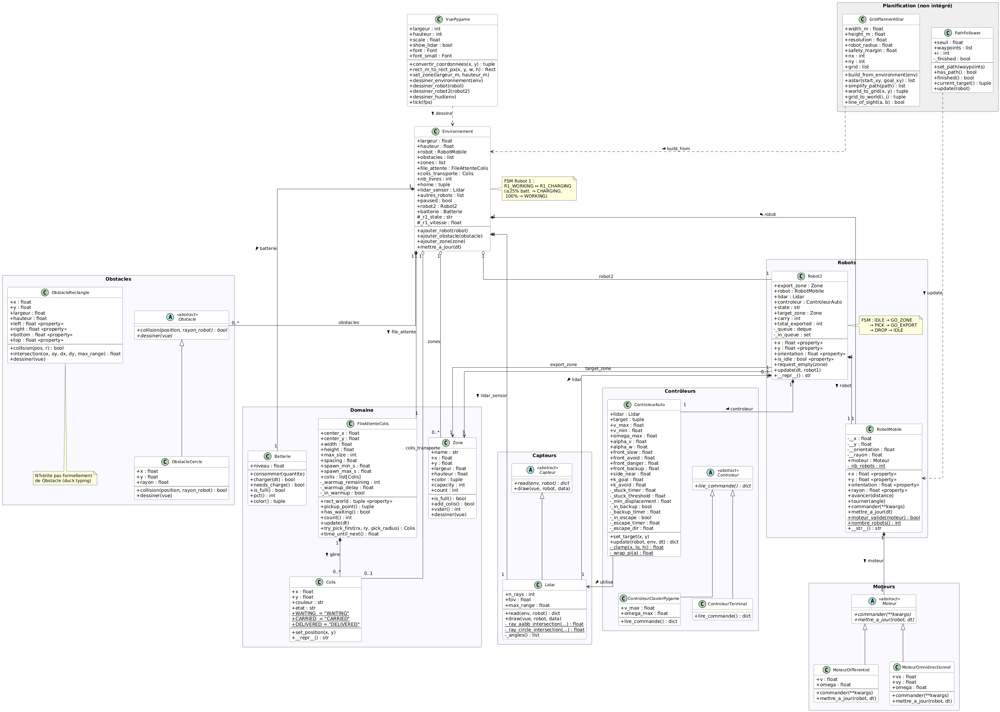

# Simulation de Robotique Mobile Autonome

Simulation 2D de deux robots autonomes dans un entrepôt, développée en **Python + Pygame**.  
Robot 1 collecte des colis sur un convoyeur et les trie par couleur dans des zones de stockage. Robot 2 vide automatiquement les zones pleines vers une zone d'export.



---

## Prérequis & Lancement

```bash
pip install pygame
python main.py
```

**Touches clavier :**

| Touche | Action |
|--------|--------|
| `H` | Afficher / masquer les rayons Lidar |
| `P` | Pause / reprise |
| Fermer la fenêtre | Quitter |

---

## Scénario de simulation

Le monde fait **10 m × 10 m** et contient :

| Zone | Position | Rôle |
|------|----------|------|
| `STORAGE_GREEN` | (−3.5, −3.5) | Stockage colis verts (capacité 5) |
| `STORAGE_RED` | (3.5, 2.8) | Stockage colis rouges (capacité 5) |
| `EXPORT` | (−4.0, 4.0) | Destination finale (Robot 2) |
| `CHARGE` | (−3.8, 0.0) | Recharge batterie Robot 1 |
| Convoyeur | (3.55, −4.35) | Source de colis (file FIFO) |

Des **murs internes** (rectangles) créent un labyrinthe que les robots doivent contourner.

### Comportement de Robot 1

1. Se rend au convoyeur et prend le premier colis disponible.
2. Navigue vers `STORAGE_GREEN` ou `STORAGE_RED` selon la couleur du colis.
3. Dépose le colis (consomme **25 % de batterie**).
4. Si la zone est pleine, notifie Robot 2 pour la vider.
5. Si la batterie atteint ≤ 25 %, abandonne la mission, se rend sur `CHARGE` et recharge jusqu'à 100 %.

### Comportement de Robot 2

Suit une FSM `IDLE → GO_ZONE → PICK → GO_EXPORT → DROP → IDLE`.  
Il surveille une file de demandes de vidage, se déplace vers la zone la plus urgente, en retire tous les colis instantanément, puis les dépose en `EXPORT`.

---

## Architecture

Le code est organisé selon un pattern **MVC**. Tout le code source se trouve dans le package `robot/` ; `main.py` est le point d'entrée.

### Hiérarchie des classes

```
Moteur (ABC)
├── MoteurDifferentiel        ← utilisé (v, ω)
└── MoteurOmnidirectionnel    ← non utilisé (vx, vy, ω)

Capteur (ABC)
└── Lidar                     ← 41 rayons, FOV 220°, portée 4 m

Obstacle (ABC)
├── ObstacleRectangle         ← murs du monde (méthode slab pour Lidar)
└── ObstacleCercle            ← non utilisé dans la carte actuelle

Controleur (ABC)
├── ControleurTerminal
└── ControleurClavierPygame

RobotMobile                   ← attributs privés + @property
Robot2
  ├── RobotMobile
  ├── Lidar
  └── ControleurAuto

Environnement
  ├── RobotMobile (Robot 1)
  ├── [Obstacles]
  ├── [Zones]
  └── FileAttenteColis
```

### Boucle de jeu (`game_loop`)

Chaque frame (DT = 0.1 s, 60 FPS) s'exécute dans cet ordre :

```
Événements Pygame
    → Mise à jour convoyeur
    → FSM Robot 2
    → FSM batterie Robot 1
    → Mission Robot 1 (prise / dépôt)
    → Contrôleur Robot 1 (navigation + évitement)
    → Physique + rollback collisions
    → Rendu
```

### Physique et collisions

`Environnement.mettre_a_jour(dt)` sauvegarde la pose avant mouvement, intègre la cinématique, puis vérifie trois types de collisions dans l'ordre — **bords du monde**, **obstacles**, **inter-robots** — et effectue un *rollback* de la pose en cas de collision.

### Évitement d'obstacles (`ControleurAuto`)

Le Lidar alimente une machine à états à 5 modes basée sur la distance frontale minimale :

| Mode | Seuil | Comportement |
|------|-------|--------------|
| Normal | > 0.85 m | Vitesse max + répulsion vectorielle |
| Ralentissement | ≤ 0.85 m | Réduction de vitesse |
| Évitement | ≤ 0.55 m | Vitesse réduite + biais de braquage latéral |
| Danger | ≤ 0.35 m | Inversion de direction |
| BACKUP | ≤ 0.22 m | Marche arrière |
| ESCAPE | bloqué > 1.5 s | Rotation sur place jusqu'au déblocage |

La détection de blocage compare le déplacement par tick (seuil 0.03 m) et accumule un chrono ; à 1.5 s elle déclenche ESCAPE.

### Capteur Lidar

- **Paramètres :** 41 rayons, FOV 220°, portée 4 m
- **Intersection obstacles :** méthode des slabs (ray-AABB)
- **Intersection robots :** ray-cercle analytique
- Les deux robots sont mutuellement visibles via `env.autres_robots`

---

## Constantes clés

Toutes définies en tête de `main.py` :

| Constante | Valeur | Rôle |
|-----------|--------|------|
| `DT` | 0.1 s | Pas de temps physique |
| `FPS` | 60 | Fréquence de rendu |
| `PICK_RADIUS` | 0.45 m | Distance de prise de colis |
| `DROP_RADIUS` | 0.55 m | Distance de dépôt |
| `CHARGE_RADIUS` | 0.60 m | Distance de déclenchement de la recharge |
| `ZONE_CAPACITY` | 5 | Capacité max par zone de stockage |
| `CONSO_PAR_COLIS` | 25 % | Batterie consommée par livraison |
| `CHARGE_SEUIL` | 25 % | Seuil de déclenchement de la recharge |

---

## Extension du projet

| Ce qu'on veut ajouter | Comment |
|-----------------------|---------|
| Nouveau type de moteur | Sous-classer `Moteur` (ABC) et implémenter `commander()` / `mettre_a_jour(robot, dt)` |
| Nouveau type d'obstacle | Sous-classer `Obstacle` (ABC dans `robot/obstacle.py`) et implémenter `collision()` + `dessiner()` |
| Navigation par A* | `GridPlannerAStar` (`robot/planner_astar.py`) et `PathFollower` (`robot/path_follower.py`) existent mais ne sont pas câblés dans la boucle principale |
| Troisième robot | Instancier un `Robot2` supplémentaire et l'enregistrer dans `env.autres_robots` pour la visibilité Lidar |

---

## Diagramme UML

Le diagramme de classes PlantUML est disponible dans [`uml/class_diag.puml`](uml/class_diag.puml).

---

## Notes

- L'intégralité du code (variables, docstrings, commentaires) est rédigée en **français**.
- Il n'y a pas de suite de tests ni de configuration de linter.
- Les assets graphiques (sprites robots, image convoyeur) se trouvent dans `assets/`.
